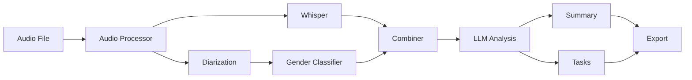

<!-- filepath: c:\Users\Admin\Downloads\AMITA_project-master\README.md -->

<div align="center">

# 🎙️ AMITA Meeting Analyzer

**AI-Powered Meeting Transcription & Analysis System**

[](https://www.python.org/downloads/)
[](https://pytorch.org/)
[](LICENSE)
[](https://developer.nvidia.com/cuda-toolkit)

**Chuyển đổi cuộc họp thành transcript có speaker labels + Tóm tắt AI + Trích xuất tasks tự động**

[Tính năng](#-tính-năng) • [Cài đặt](#-cài-đặt) • [Sử dụng](#-sử-dụng) • [Demo](#-demo) • [Docs](#-tài-liệu)

</div>

---

## 📖 Mục lục

- [Giới thiệu](#-giới-thiệu)
- [Tính năng](#-tính-năng)
- [Kiến trúc hệ thống](#️-kiến-trúc-hệ-thống)
- [Yêu cầu hệ thống](#-yêu-cầu-hệ-thống)
- [Cài đặt](#-cài-đặt)
- [Cấu hình](#️-cấu-hình)
- [Sử dụng](#-sử-dụng)
- [Demo & Kết quả](#-demo--kết-quả)
- [Performance](#-performance)
- [Troubleshooting](#-troubleshooting)
- [Contributing](#-contributing)
- [License](#-license)

---

## 🎯 Giới thiệu

**AMITA (AI Meeting Intelligence & Transcription Assistant)** là hệ thống phân tích cuộc họp tự động sử dụng AI tiên tiến nhất:

### ✨ Điểm nổi bật

- 🎤 **Speaker Diarization** - Phân biệt ai nói khi nào (Pyannote 3.1)
- 📝 **Transcription** - Chuyển giọng nói thành text (Faster-Whisper)
- 👤 **Gender Classification** - Phân loại giới tính người nói
- 🧠 **LLM Analysis** - Tóm tắt & trích xuất tasks (Ollama)
- 🖥️ **Web Interface** - Giao diện thân thiện (Streamlit)
- 🔗 **Export Integration** - Trello, Notion, ClickUp

### 🚀 Tốc độ

- **GPU (RTX 3050):** 4-5x realtime
- **CPU (i7):** 0.5x realtime
- **File 30 phút:** ~6-7 phút (GPU) hoặc ~45-60 phút (CPU)

### 🎯 Use cases

- ✅ Phiên họp nội bộ
- ✅ Interview, phỏng vấn
- ✅ Podcast, webinar
- ✅ Ghi chép y tế, tòa án
- ✅ Customer support calls

---

## 🌟 Tính năng

### 1. **Pipeline xử lý đầy đủ**

```
Audio Input → Preprocessing → Diarization → Gender → Whisper → Combining → LLM → Output
```

### 2. **Core Features**

| Feature | Mô tả | Công nghệ |
|---------|-------|-----------|
| **Speaker Diarization** | Phát hiện ai nói khi nào | Pyannote 3.1 |
| **Transcription** | Chuyển giọng nói → text | Faster-Whisper |
| **Gender Classification** | Phân loại nam/nữ | Pitch Analysis |
| **LLM Summary** | Tóm tắt cuộc họp | Ollama (llama3.2) |
| **Task Extraction** | Trích xuất công việc | LLM + NLP |
| **Export** | Xuất sang tools | Trello/Notion/ClickUp API |

### 3. **Advanced Features**

- ✅ **GPU Acceleration** - CUDA support (3-5x faster)
- ✅ **Chunked Processing** - Xử lý file dài (>1h) hiệu quả
- ✅ **Checkpointing** - Resume từ crash/interrupt
- ✅ **Spam Filtering** - Loại bỏ lặp/noise tự động
- ✅ **Progress Tracking** - Real-time ETA
- ✅ **Multi-format** - MP3, WAV, M4A, AAC, OGG, FLAC
- ✅ **Text Preprocessing** - 7-stage LLM input optimization

---

## 🏗️ Kiến trúc hệ thống

### Pipeline Architecture



### Tech Stack

```python
# Core ML/DL
PyTorch 2.7+           # Deep learning framework
faster-whisper 0.10+   # Optimized Whisper
pyannote.audio 3.1     # Speaker diarization

# Audio Processing
librosa 0.10+          # Audio analysis
soundfile 0.12+        # Audio I/O
pydub 0.25+            # Audio manipulation

# LLM
ollama 0.1+            # Local LLM server

# Web Interface
streamlit 1.30+        # Web framework

# Integrations
py-trello 0.19+        # Trello API
notion-client 2.2+     # Notion API
requests 2.31+         # ClickUp API
```

---

## 💻 Yêu cầu hệ thống

### Minimum Requirements

- **OS:** Windows 10/11, Linux (Ubuntu 20.04+), macOS 10.15+
- **CPU:** Intel Core i5 hoặc tương đương
- **RAM:** 8GB
- **Storage:** 10GB khả dụng
- **Python:** 3.8 - 3.12

### Recommended Requirements

- **CPU:** Intel Core i7 hoặc AMD Ryzen 7
- **RAM:** 16GB
- **GPU:** NVIDIA GPU với 4GB+ VRAM
- **CUDA:** 11.8 hoặc 12.1
- **Storage:** 20GB SSD

### GPU Support (Optional nhưng khuyến nghị)

| GPU | VRAM | Whisper Model | Performance |
|-----|------|---------------|-------------|
| RTX 3050 | 4GB | small/medium | 4x realtime |
| RTX 3060 | 12GB | medium/large | 5x realtime |
| RTX 4070 | 12GB | large | 6x realtime |

**Không có GPU?** → Vẫn chạy được trên CPU (chậm hơn 10x)

---

## 🚀 Cài đặt

### Bước 1: Clone Repository

```bash
git clone https://github.com/YOUR_USERNAME/AMITA-Meeting-Analyzer.git
cd AMITA-Meeting-Analyzer
```

### Bước 2: Tạo Virtual Environment

```bash
# Windows
python -m venv .venv
.venv\Scripts\Activate.ps1

# Linux/Mac
python3 -m venv .venv
source .venv/bin/activate
```

### Bước 3: Cài PyTorch (QUAN TRỌNG)

**Nếu có GPU NVIDIA:**
```bash
pip install torch torchaudio --index-url https://download.pytorch.org/whl/cu118
```

**Nếu chỉ có CPU:**
```bash
pip install torch torchaudio --index-url https://download.pytorch.org/whl/cpu
```

**Test GPU:**
```bash
python test_gpu.py
```

### Bước 4: Cài Dependencies

```bash
pip install -r requirements.txt
```

### Bước 5: Cài FFmpeg

**Windows (Winget):**
```bash
winget install ffmpeg
```

**Linux:**
```bash
sudo apt-get update && sudo apt-get install ffmpeg
```

**macOS:**
```bash
brew install ffmpeg
```

### Bước 6: HuggingFace Token

1. Tạo token: https://huggingface.co/settings/tokens
2. Accept terms:
   - https://huggingface.co/pyannote/speaker-diarization-3.1
   - https://huggingface.co/pyannote/segmentation-3.0

3. Update `config.py`:
```python
HF_TOKEN = "hf_your_token_here"
```

### Bước 7: Ollama (Optional - cho LLM)

```bash
# Download: https://ollama.ai
ollama pull llama3.2
```

---

## ⚙️ Cấu hình

### File `config.py` - Chi tiết

```python
# ===== AUDIO =====
AUDIO_FILE = r"C:\path\to\your\audio.mp3"
OUTPUT_JSON = "transcription_output.json"

# ===== GPU =====
USE_GPU = True  # Auto-detect GPU, fallback CPU

# ===== WHISPER =====
WHISPER_MODEL = "medium"  # tiny/base/small/medium/large
LANGUAGE = "vi"  # vi (Việt), en (English), None (auto)

# ===== DIARIZATION =====
MIN_SPEAKERS = None  # Auto-detect
MAX_SPEAKERS = None  # Auto-detect

# ===== LLM =====
ENABLE_LLM_ANALYSIS = True
OLLAMA_MODEL = "llama3.2"  # llama3.2, mistral, etc.

# ===== ADVANCED =====
ENABLE_CHECKPOINTING = True  # Resume từ crash
ENABLE_RETRY = True  # Retry failed chunks
AUTO_CLEANUP = True  # Xóa temp files
SHOW_PROGRESS_BAR = True
```

### Cấu hình cho từng Use Case

#### 1. **File ngắn (<30 phút), chất lượng tốt**
```python
WHISPER_MODEL = "small"
USE_GPU = True
```

#### 2. **File dài (>1 giờ), cần chính xác**
```python
WHISPER_MODEL = "medium"
WHISPER_CHUNK_LENGTH = 10
ENABLE_CHECKPOINTING = True
```

#### 3. **Nhiều người nói (>5 người)**
```python
MIN_SPEAKERS = 5
MAX_SPEAKERS = 10
```

#### 4. **Audio kém chất lượng (noise, echo)**
```python
VALIDATE_AUDIO_QUALITY = True
AUDIO_SAMPLE_RATE = 16000
HIGH_PASS_CUTOFF = 80
```

---

## 📚 Sử dụng

### CLI Mode (Recommended)

```bash
# 1. Cập nhật AUDIO_FILE trong config.py
# 2. Chạy full pipeline
python main.py

# Kết quả trong outputs/
```

### Web Interface

```bash
streamlit run app.py
# Mở: http://localhost:8501
```

### Chạy riêng từng Stage

```bash
# Stage 0: Audio preprocessing
python src/audio_processor.py

# Stage 1: Diarization
python src/diarization.py

# Stage 2: Gender classification
python src/gender_classifier.py

# Stage 3: Whisper transcription
python src/whisper.py

# Stage 4: Combining
python src/combiner.py

# Stage 5: LLM analysis
python src/llm_applying.py
```

---

## 🎬 Demo & Kết quả

### CLI Output

```bash
================================================================================
🎯 OPTIMIZED PIPELINE
================================================================================

📁 File: meeting.mp3 (32.5 min)
🎮 GPU: RTX 3050 (4GB VRAM)
🤖 LLM: Ollama (llama3.2)

⏱️  Stage 0: Preprocessing    →    46s   (2.7%)
⏱️  Stage 1: Diarization      →   130s   (7.7%)  ✅ GPU
⏱️  Stage 2: Gender           →     1s   (0.0%)
⏱️  Stage 3: Whisper          →  1508s  (89.5%)  ✅ GPU
⏱️  Stage 4: Combining        →     0s   (0.0%)
⏱️  Stage 5: LLM Analysis     →   120s   (7.1%)
────────────────────────────────────────
⏱️  TOTAL                     →  1805s  (30 min)

✅ HOÀN THÀNH!
```

### Output Files

```
outputs/
├── whisper_output.json          # Transcription
├── diarization_output.json      # Speaker segments
├── gender_output.json           # Gender info
├── combining_output.json        # ⭐ Main output
├── dialog.txt                   # Human-readable dialog
├── summary.txt                  # LLM summary
└── tasks.json                   # Extracted tasks
```

### Example Output

**combining_output.json:**
```json
[
  {
    "speaker": "SPEAKER_00",
    "gender": "Female",
    "start": 2.44,
    "end": 5.12,
    "text": "Xin chào mọi người, hôm nay chúng ta bàn về dự án mới."
  },
  {
    "speaker": "SPEAKER_01",
    "gender": "Male",
    "start": 5.80,
    "end": 9.32,
    "text": "Dạ, em đã chuẩn bị báo cáo về tiến độ."
  }
]
```

**summary.txt:**
```
Chủ đề chính: Họp review dự án tháng 11

Các điểm quan trọng:
- Dự án đang tiến triển tốt, hoàn thành 75%
- Gặp vấn đề về API integration, cần thêm thời gian
- Team backend cần tăng cường 1-2 người

Quyết định:
- Gia hạn deadline thêm 2 tuần
- Anh Minh contact team backend để bổ sung nhân lực
```

**tasks.json:**
```json
[
  {
    "task": "Contact team backend để bổ sung 1-2 người",
    "assigned_to": "Anh Minh",
    "deadline": "Thứ 6 tuần này",
    "priority": "high"
  },
  {
    "task": "Hoàn thiện API integration",
    "assigned_to": "Team backend",
    "deadline": "2 tuần nữa",
    "priority": "high"
  }
]
```

---

## 📊 Performance

### Benchmarks

| Configuration | File | Duration | Processing Time | Speed |
|--------------|------|----------|-----------------|-------|
| RTX 3050 4GB | meeting.mp3 | 32.5 min | 30 min | 1.08x |
| RTX 3060 12GB | podcast.wav | 60 min | 18 min | 3.33x |
| CPU i7-10700 | interview.m4a | 30 min | 52 min | 0.58x |

### GPU vs CPU

| Task | GPU (RTX 3050) | CPU (i7) | Speedup |
|------|----------------|----------|---------|
| Diarization | 130s | 520s | 4.0x |
| Whisper | 1508s | 7200s | 4.8x |
| **Total** | 1805s | 8640s | 4.8x |

---

## 🐛 Troubleshooting

### GPU không hoạt động

```bash
# 1. Test GPU
python test_gpu.py

# 2. Nếu fail → Cài lại PyTorch
pip uninstall torch torchaudio
pip install torch torchaudio --index-url https://download.pytorch.org/whl/cu118

# 3. Update NVIDIA driver
# Download: https://www.nvidia.com/Download/index.aspx
```

### Ollama error

```bash
# 1. Start Ollama
ollama serve

# 2. Pull model
ollama pull llama3.2

# 3. Test
ollama run llama3.2 "Hello"
```

### File quá lớn / OOM

```python
# config.py
WHISPER_CHUNK_LENGTH = 5  # Giảm chunk size
ENABLE_CHECKPOINTING = True
```

### Kết quả không chính xác

```python
# 1. Cải thiện audio quality
python src/audio_processor.py

# 2. Set số người nói
MIN_SPEAKERS = 2
MAX_SPEAKERS = 4

# 3. Dùng model lớn hơn
WHISPER_MODEL = "large"
```

---

## 🤝 Contributing

Contributions are welcome! Please:

1. Fork repository
2. Create feature branch
3. Commit changes
4. Push to branch
5. Open Pull Request

---

## 📄 License

MIT License - see [LICENSE](LICENSE) file

---

## 🙏 Acknowledgments

- **Pyannote Team** - Speaker diarization models
- **OpenAI** - Whisper transcription
- **Ollama** - Local LLM deployment
- **HuggingFace** - Model hosting

---

<div align="center">

**⭐ Star this repo if you find it useful!**

Made with ❤️ in Vietnam

[Report Bug](https://github.com/YOUR_USERNAME/AMITA/issues) • [Request Feature](https://github.com/YOUR_USERNAME/AMITA/issues)

</div>
